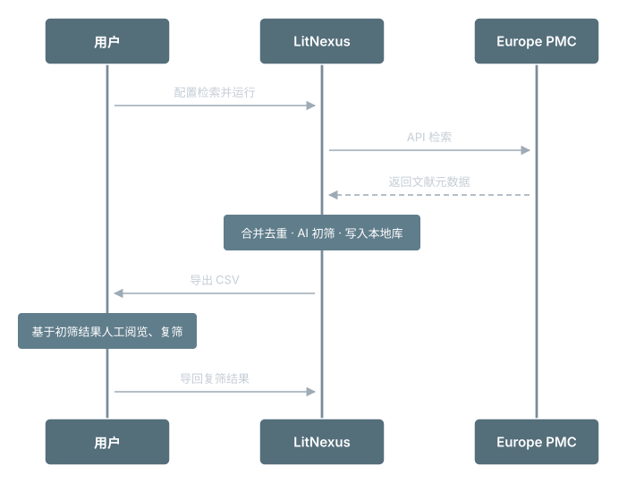

---
hide:
  - navigation
---

# 概览

## 什么是 LitNexus

LitNexus 可以一键实现，对指定时间范围内的、指定`期刊/作者/关键词`的文献的全覆盖检索与 AI 筛选

---

## 如何使用 LitNexus

-   :material-rocket-launch:{ .lg .middle } **快速开始**

    ---

    安装、上手与常见问题

    [:octicons-arrow-right-24: 开始使用](start/quickstart.md)

-   :material-book-open-page-variant:{ .lg .middle } **使用指南**

    ---

    详细的使用指南与说明

    [:octicons-arrow-right-24: 详细教程](guide/run.md)

-   :material-sitemap:{ .lg .middle } **原理与参考**

    ---

    LitNexus 背后的实现

    [:octicons-arrow-right-24: 了解更多](reference/product.md)

-   :material-code-braces:{ .lg .middle } **开发与进度**

    ---

    LitNexus 的后续开发

    [:octicons-arrow-right-24: 路线图](develop/roadmap.md)

---

## LitNexus 工作流

{ .diagram-img }

---

## LitNexus 解决什么

!!! question "为什么要用 LitNexus？"
    - 需要进行 journal club 的时候不知道要讲什么？
    - 想要每日跟进最新最前沿的文献，但是没有好的方法？
    - Google Scholar、PubMed、WOS 等工具的文献订阅功能无法满足需求？
    - 太多前沿文献无法快速找到自己想要的？

---

## LitNexus 带来什么

LitNexus 可以实现高度自定义的文献检索流！

!!! success "LitNexus 使用最简单的工作哲学"
    1. 基于期刊列表/自定义检索式，检索指定时间范围所有文章
    2. 基于自定义的 AI 提示词，帮你快速筛选掉大量无关文章
    3. 基于 AI 翻译标题摘要
    4. 导出经过筛选后精简的文章列表，对着准确的中文翻译快速复筛你想要的文章
    5. 使用你喜欢的方式，阅读最新的前沿文章

!!! success "LitNexus 的高度自定义"
    1. 通过期刊列表，关注该期刊的所有文章
    2. 通过自定义检索式，关注关键课题组所有文章
    3. 通过自定义检索式，补充关注特定领域内所有前两条没有覆盖的文章

!!! success "LitNexus 的完整覆盖度"
    1. 基于 Europe PMC 可以同步 PubMed 中的所有文章
    2. 基于 Europe PMC 可以覆盖 *bioRxiv* 与 *ArXiv* 以及 *ResearchGate* 等预印本平台中的生物学相关文章

---

## LitNexus 不做什么

!!! warning "不替代任何成熟的工具产品"
    - <u> **不是 Zotero / EndNote 替代品**</u> ：不负责精细的文献管理，请继续使用你喜爱的文献管理工具
    - <u> **不会自动推荐相关文献**</u> ：只忠实的搜索你设定的检索范围，不会“自动挖掘”相关文献
    - <u> **不会智能分析文献是否相关**</u> ：只忠实的按照你设置的 prompt 判断文献是否通过筛选

---

## 链接与联系

-   :material-account-circle:{ .lg .middle } **作者 / 反馈**

    ---

    - GitHub：[kiancai](https://github.com/kiancai)  
    - 小红书：[kiancai](https://www.xiaohongshu.com/user/profile/5dc6ed59000000000100374e)

-   :fontawesome-brands-github:{ .lg .middle } **代码 / 发行**

    ---

    - [GitHub 仓库](https://github.com/kiancai/LitNexus)  
    - [Releases](https://github.com/kiancai/LitNexus/releases)  

