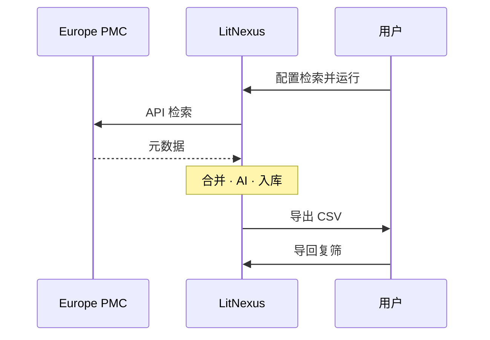

# 组件示例（选型用）

本页 **不是** 产品功能说明，只展示 Material for MkDocs（社区版）里常用的版式，方便你挑「开始使用 / 使用指南」以后要用的样子。

选定后可以删掉本页，或挪到开发区当内部参考。

!!! warning "选型页"
    内容为占位演示；样式以你本机 `mkdocs serve` 为准。

---

## 1. 提示框（Admonition）

!!! note "note 笔记"
    中性说明。

!!! abstract "abstract 摘要"
    概要、摘要。

!!! info "info 信息"
    补充信息。

!!! tip "tip 技巧"
    建议、窍门。

!!! success "success 成功"
    完成、通过。

!!! question "question 问题"
    提问语气（也可配合折叠，见下）。

!!! warning "warning 警告"
    注意风险。

!!! failure "failure 失败"
    失败、未通过。

!!! danger "danger 危险"
    高风险操作。

!!! bug "bug 缺陷"
    已知问题。

!!! example "example 示例"
    举例。

!!! quote "quote 引用"
    引用或金句。

可改标题与类型：

```markdown
!!! tip "自定义标题"
    正文支持 **Markdown**。
```

---

## 2. 可折叠（Details）

??? note "默认收起的 note"
    点标题展开。适合长说明、可选步骤。

???+ tip "默认展开的 tip（`???+`）"
    打开页面时已是展开状态。

??? warning "折叠警告"
    里面还可以有列表：

    1. 第一步  
    2. 第二步  

??? question "折叠问答（FAQ 常用）"
    答案写在这里。可含链接与代码：

    ```bash
    swift run LitNexus selftest
    ```

嵌套示例：

??? note "外层"
    外层内容。

    ??? tip "内层"
        内层内容。

---

## 3. 选项卡（Tabs）

=== "macOS"
    Mac 相关步骤。

=== "Windows"
    Windows 相关步骤。

=== "通用"
    两边一样时写这里。

代码块选项卡：

=== "Swift"
    ```swift
    print("LitNexus")
    ```

=== "C#"
    ```csharp
    Console.WriteLine("LitNexus");
    ```

---

## 4. 卡片网格（Cards）

<div class="grid cards" markdown>

-   :material-clock-fast:{ .lg .middle } **五分钟上手**

    ---

    安装 → 工作区 → 跑一轮。

    [:octicons-arrow-right-24: 快速上手](quickstart.md)

-   :material-help-circle:{ .lg .middle } **常见问题**

    ---

    签名、解压、CSV、AI。

    [:octicons-arrow-right-24: FAQ](faq.md)

-   :material-github:{ .lg .middle } **源码**

    ---

    仓库与 Issue。

    [:octicons-arrow-right-24: GitHub](https://github.com/kiancai/LitNexus)

-   :material-book-open-variant:{ .lg .middle } **原理**

    ---

    动机与边界。

    [:octicons-arrow-right-24: 概述](../reference/product.md)

</div>

---

## 5. 列表与任务

普通列表：

- 苹果  
- 香蕉  
- 车厘子  

有序列表：

1. 下载  
2. 合并  
3. 导出  

任务列表：

- [x] 写中文结构  
- [x] 概览 / 快速上手 / FAQ  
- [ ] 定稿后删选型页或降级  
- [ ] 对齐英文  

定义列表：

术语 A
:   解释 A。

工作区
:   自包含数据目录（配置 + 库 + 下载 + 导出）。

---

## 6. 表格

| 阶段 | 状态 | 说明 |
|------|------|------|
| Mac | 主线 | 功能完整，文档收尾中 |
| Windows | Preview | 数据闭环优先 |
| Linux | 不做 | 现阶段范围外 |

对齐与强调可在单元格里用 `**粗体**`。

---

## 7. 代码与高亮

行内：`litnexus.toml`、`epmc_id`。

代码块 + 行号锚点（扩展已开）：

```python
def greet(name: str) -> str:
    return f"hello, {name}"
```

行内高亮：用 `#!python range(1, 5)` 这种形式（若主题支持 inlinehilite）。

---

## 8. 键盘按键

- 复制：++ctrl+c++（Windows / Linux）或 ++cmd+c++（Mac）  
- 设置：++cmd+comma++  
- 搜索：++slash++（Material 文档站常见）  

```markdown
++ctrl+alt+del++
++cmd+shift+p++
```

---

## 9. 文本修饰

- 高亮：==很重要==（`pymdownx.mark`）  
- 下标 / 上标相关：H~2~O、X^2^（若启用 caret/tilde）  
- 删除线：~~废弃说法~~  
- 脚注：这里挂一个脚注[^demo]

[^demo]: 脚注正文出现在页面底部。

缩写（悬停可见全文，需 `abbr`）：

The HTML specification is maintained by the W3C.

*[HTML]: Hyper Text Markup Language
*[W3C]: World Wide Web Consortium

---

## 10. 引用与分隔

> 最终取舍归人；AI 只做初筛。

---

## 11. 图标（Emoji 扩展）

Material / Octicons / Font Awesome 等（需 `pymdownx.emoji`）：

:material-heart: :material-star: :material-check-circle:  
:fontawesome-brands-github: :fontawesome-brands-apple:  
:octicons-book-16: :octicons-download-16:

按钮感链接可配合图标写在卡片里（见上）。

---

## 12. 流程图（Mermaid）

若构建环境允许，可用 fenced `mermaid`（Material 集成）：



概览页用同一类时序图；颜色跟 Material 默认 Mermaid 主题。

---

## 13. 嵌套综合示例

!!! example "把多种组件叠在一起"

    === "步骤"

        1. 打开工作区  
        2. 配置检索  

        ??? tip "可选：开 AI"
            在配置页添加方案与密钥。

    === "注意"

        !!! danger "不要双端同时写库"
            先退出一端再在另一端打开同一工作区。

---

## 你怎么用这个页

| 你想要的文档感 | 可优先用 |
|----------------|----------|
| 注意 / 警告 / 成功 | Admonition |
| FAQ、长附录 | `???` 折叠 |
| Mac / Win 分写 | Tabs |
| 首页导航感 | Cards 网格 |
| 步骤清单 | 有序 / 任务列表 |
| 快捷键说明 | `++keys++` |

选定后在正文里统一风格即可；本页可随时删。
